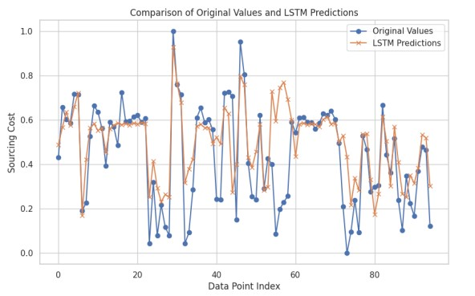
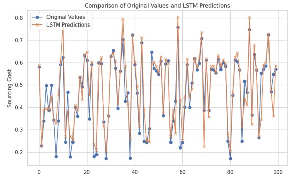

# AP Moller Maersk DS-AIML challenge

**Overview**

This project aims to predict the sourcing costs of various product combinations using machine learning models. The dataset contains information about different attributes such as product type, manufacturer, area code, sourcing channel, product size, and more. The goal is to forecast the sourcing costs for June 2021 using data from July 2020 to May 2021.

**Dataset**

The dataset comprises rows representing the sourcing of one unit of a particular product combination. Each unique product combination is represented by attributes in Columns A to F. Training data spans from July 2020 to May 2021, and June 2021 is the test set. Multiple rows may have the same combination in the training dataset. The test set (June 2021) contains only a single value for each combination.

**Approach**

- Exploratory Data Analysis (EDA): Understand the dataset's structure, distributions, and relationships between variables.
- Data Preprocessing: Handle outliers and poor data quality, feature engineering, and data cleaning.
- Model Building and Evaluation: Implement various machine learning algorithms such as linear regression, decision tree, random forest, XGBoost, and LSTM. Evaluate their performance using metrics like MSE, RMSE, MAE, and R-squared score.
- Optimization: Apply optimization techniques to enhance model performance, such as outlier removal and feature engineering.
- Model Selection: Choose the best-performing model based on evaluation metrics and optimize it further if necessary.
- Forecasting: Use the selected model to forecast the sourcing costs for June 2021.

**Modeling**

- Linear Regression
- Decision Tree Regressor
- Random Forest Regressor
- XGBoost Regressor
- LSTM(Best)

### LSTM Output

Training-

Testing-

**Conclusion**

The best-performing model among the ones evaluated is LSTM. In this analysis, I developed predictive models to estimate sourcing costs based on product attributes and other factors. By employing machine learning algorithms and optimization techniques, I achieved significant improvements in predictive accuracy. The LSTM model demonstrated the strongest performance, indicating its suitability for predicting sourcing costs for the test dataset in June 2021.

